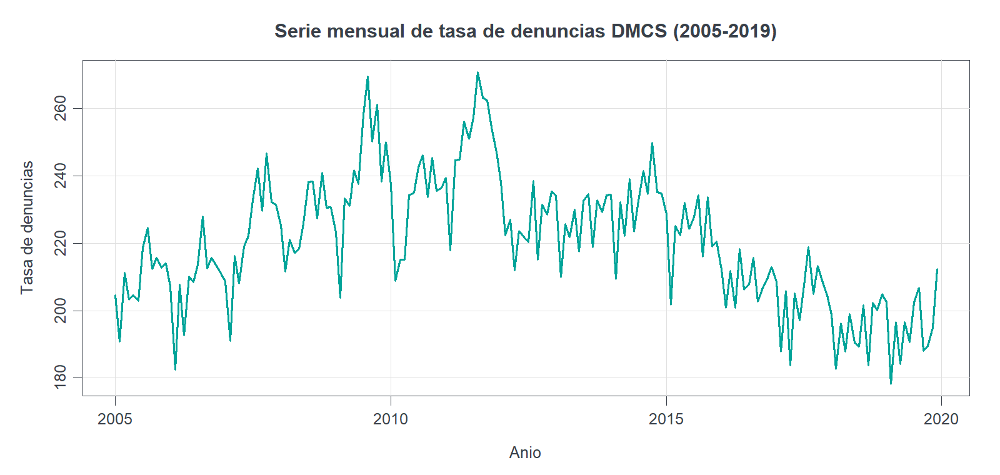
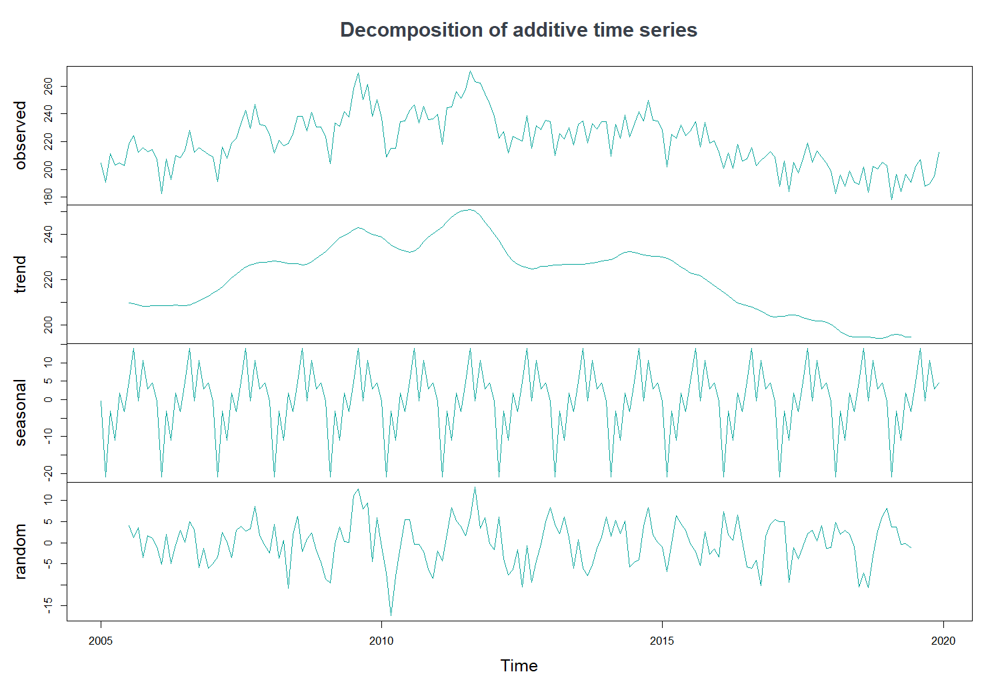
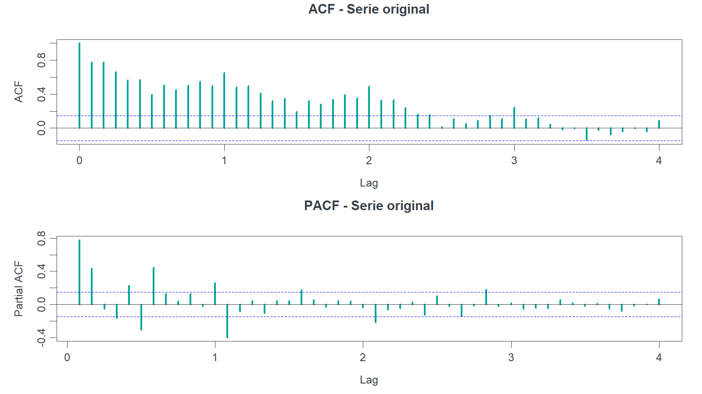
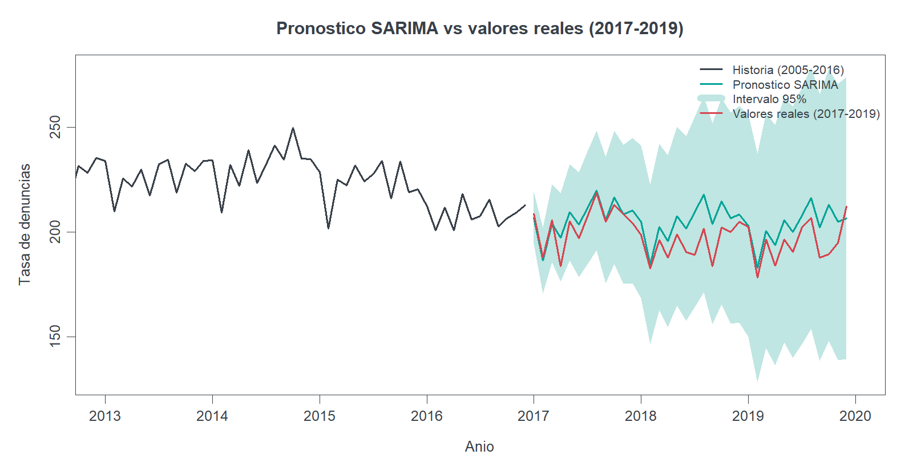

<div align="center">

# 📈 Series de Tiempo · Ingeniería Estadística USACH

### Análisis de la tasa mensual de denuncias DMCS (2005-2019) con la metodología Box-Jenkins en R

[](https://www.r-project.org/)
[](https://pkg.robjhyndman.com/forecast/)
[](https://posit.co/)
[](https://www.usach.cl/)

</div>

---

## 📌 Sobre el proyecto

Este repositorio reúne el material teórico y práctico de la asignatura **Series de Tiempo**, desarrollado para el **Taller 1** de Ingeniería Estadística de la Universidad de Santiago de Chile (USACH), primer semestre de 2026. El Taller 1 corresponde a la primera práctica profesional de la carrera, una actividad interna supervisada por profesores.

El objetivo es reunir una implementación práctica en R de los principales contenidos de la asignatura, sobre un caso real: una serie mensual de **tasa de denuncias DMCS** con 180 observaciones (enero 2005 a diciembre 2019). El trabajo combina:

- una **parte teórica**, que explica los fundamentos, componentes y propiedades de una serie temporal, y
- una **parte práctica** en RStudio, que analiza la serie mediante descomposición clásica, modelos de suavizamiento y modelos **SARIMA** bajo la metodología Box-Jenkins.

## 📊 La serie y sus resultados

La serie muestra estacionalidad anual marcada y una tendencia que sube hasta 2011-2012 y desciende de forma sostenida hacia el final del período. Su rango va de 178,3 a 270,7 denuncias, con una media de 220,32.



La descomposición aditiva separa las tres componentes: una tendencia con forma de campana, un patrón estacional de amplitud estable y un residuo sin estructura evidente.



La función de autocorrelación decae lentamente con picos en los rezagos estacionales, señal de una serie no estacionaria con estacionalidad de período 12; el periodograma confirma un **período dominante de 12 meses**.



### Comparación de modelos

Se ajustaron cuatro enfoques sobre el conjunto de entrenamiento (2005-2016) y se compararon por el error porcentual absoluto medio (MAPE):

| Modelo | MAPE (entrenamiento) |
|---|---:|
| SARIMA automático (0,1,1)(0,1,1)[12] | **2,08 %** |
| SARIMA manual (0,1,0)(1,1,1) | 2,10 % |
| Holt-Winters multiplicativo | 2,39 % |
| Regresión con dummies estacionales | 2,96 % |

El modelo **SARIMA(0,1,1)(0,1,1)[12]** seleccionado automáticamente resultó el más preciso y parsimonioso. Al proyectarlo sobre el conjunto de prueba (2017-2019), que no participó en el ajuste, alcanzó un **MAPE de 3,92 %**, y los valores reales se mantuvieron dentro de la banda de confianza del 95 %.



## 🔄 Metodología Box-Jenkins

El siguiente diagrama resume el flujo de identificación, estimación, diagnóstico y predicción seguido en el proyecto:


El script principal desarrolla este flujo de forma secuencial:

- Construcción del objeto de serie temporal y gráfico de la serie original.
- Descomposición aditiva y multiplicativa.
- Análisis de estacionariedad (test de Dickey-Fuller aumentado), transformación logarítmica, ACF y PACF.
- División en entrenamiento (2005-2016) y prueba (2017-2019).
- Ajuste de Holt-Winters y de una regresión con tendencia y dummies estacionales.
- Diagnóstico de residuos mediante pruebas de blancura (Ljung-Box, Box-Pierce, Kolmogorov-Smirnov, Bartlett, Breusch-Pagan).
- Diferenciación regular y estacional, y ajuste y comparación de modelos SARIMA.
- Pronóstico y validación contra el conjunto de prueba.
- Análisis espectral mediante periodograma.

## 🧭 Estructura del repositorio

```text
.
├── Bases de Datos/
│   └── Denuncias DMCS/            # DenunciasDMCS.xlsx (insumo principal)
├── Bibliografía/
│   ├── Diapos Clases/             # Clase1 a Clase11 y clase especial
│   ├── Programa 26231-Series-de-Tiempo.pdf
│   └── Time Series Analysis. Box & Jenkins (2008).pdf
├── Scripts/
│   └── Taller_I_SeriesDeTiempo_TMR.R
├── assets/                        # Figuras generadas para este README
├── Diagrama Resumen Box-Jenkins.png
├── Series de Tiempo PPT.pdf       # Presentación teórica y práctica
├── .here                          # Ancla de rutas relativas del paquete here
└── README.md
```

## 🖥️ Script principal

El archivo central del proyecto es [Taller_I_SeriesDeTiempo_TMR.R](./Scripts/Taller_I_SeriesDeTiempo_TMR.R). La presentación completa está en [Series de Tiempo PPT.pdf](./Series%20de%20Tiempo%20PPT.pdf).

## ⚙️ Reproducibilidad

El proyecto se ejecuta desde RStudio con rutas relativas mediante el paquete `here`. El archivo `.here` en la raíz permite que las rutas se resuelvan sin depender de la ubicación del equipo. La base se lee desde `Bases de Datos/Denuncias DMCS/DenunciasDMCS.xlsx`; el script incluye una exportación opcional a CSV (comentada, para no crear archivos derivados innecesarios).

Antes de ejecutar, instalar las librerías requeridas:

```r
install.packages(c("readxl", "lmtest", "fUnitRoots", "forecast", "here"))
```

Luego ejecutar el script desde `Scripts/Taller_I_SeriesDeTiempo_TMR.R`.

## ✍️ Autoras

**María José Valderrama Nuñez** · [@MariaJoseVN](https://github.com/MariaJoseVN)
**Tamar Rojas Castillo** · [@TamarIRC](https://github.com/TamarIRC)

Proyecto académico de Ingeniería Estadística (USACH, Taller I, 2026), desarrollado con R y RStudio.
